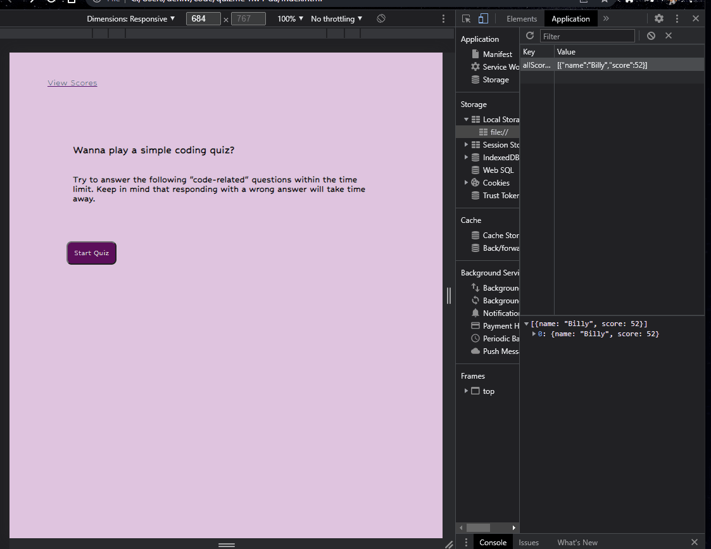

# quizme-hw4-da
## Description
This is a Javascript based quiz game.
## Installation
No installation required
## Usage
 Upon opening the link. The page will have a set of instructions and  ask if the 
 user would like to Start to play. Once the user selects the start button a timer will start to count down from 60seconds. In those 60 seconds the user will need to answer 4 questions correctly to get the highest score. The score is stored in localStorage. If the user gets an answer correct, a message will appear stating  correct, if not then the user will get a message showing incorrect. 
 Once complete the user can enter their name to gauge their score with other users.
## Tech
HTML, CSS and Javascript were utilized for this Quiz
## Demo

No license "WIP"

Kindly, Denise A

